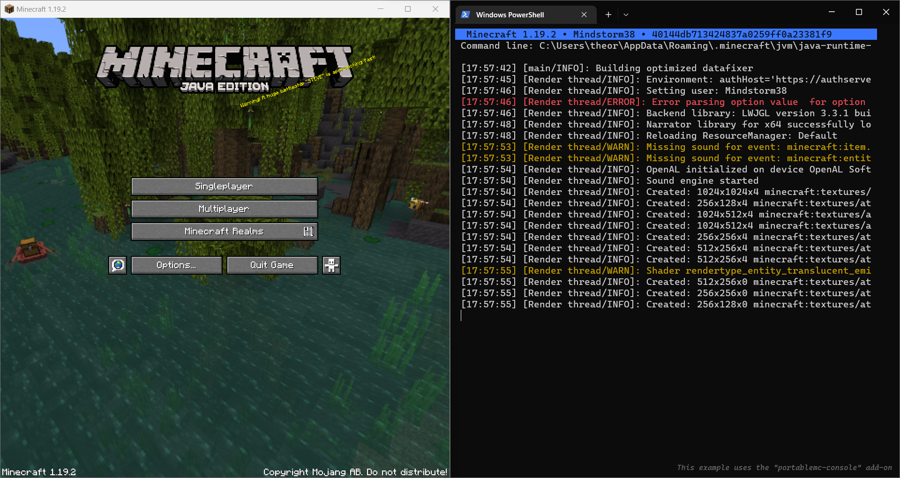

# Portable Minecraft Launcher
A fast, reliable and cross-platform command line Minecraft launcher and API for developers.
This launcher is compatible with the official Minecraft launcher' version specification.
It also includes fast installation of common mod loaders such as Fabric, Forge and Quilt.

 &nbsp;



*This launcher is tested for Python 3.7, 3.8, 3.9, 3.10, 3.11.*

## Table of contents
- [Installation](#installation)
- [Commands](#commands)
  - [Start Minecraft](#start-minecraft)
    - [Authentication](#authentication)
    - [Offline mode](#offline-mode)
    - [Custom JVM](#custom-jvm)
    - [Server auto-connect](#server-auto-connect)
    - [LWJGL version and ARM support](#lwjgl-version-and-arm-support)
    - [Fix unsupported systems](#fix-unsupported-systems)
    - [Miscellaneous](#miscellaneous)
  - [Search for versions](#search-for-versions)
  - [Authentication sessions](#authentication-sessions)
- [Log4J exploit](#log4j-exploit)
- [Certifi support](#certifi-support)
- [Contribute](#contribute)
  - [Setup environment](#setup-environment)
  - [Contributors](#contributors)
- [API Documentation (v4) ⇗](doc/API.md)

## Installation
This launcher can be installed using `pip`.  On some linux distribution you might have to 
use `pip3` instead of `pip` in order to run it on Python 3. You can also use 
`python -m pip` if the `pip` command is not in the path and the python executable is.

```sh
pip install --user portablemc
```

It's recommended to keep `--user` because this allows to install the launcher for your
current user only, it is implicit if you are not an administrator and if you are, it 
allows not to modify other users' installations.

After that, you can try to show the launcher help message using `portablemc` in your 
terminal. If it fails, you should check that the scripts directory is in your user path
environment variable. On Windows you have to search for a directory at 
`%appdata%/Python/Python3X/Scripts` and add it to the user's environment variable `Path`. 
On UNIX systems it's `~/.local/bin`.

## Commands
Arguments are split between multiple commands. 
For example `portablemc [global-args] <cmd> [args]`. 
You can use `-h` argument to display help *(also works for every sub-commands)*.

By default the launcher will run any command from the OS standard `.minecraft` directory 
([check wiki for more information](https://minecraft.gamepedia.com/.minecraft)). You can
change this directory using `--main-dir <path>` global argument.

You may also need `--work-dir <path>` to change the directory where your saves, resource 
packs and all "user-specific" content is stored. This can be useful if you have a shared 
read-only main directory (`--main-dir`) and user-specific working directory (for example 
in `.minecraft`, by default it's the location of your main directory). The launcher also
stores cached version manifest and authentication database in the working directory.

The two arguments `--main-dir` and `--work-dir` may or may not be used by sub commands, 
but they are always valid to use, allowing you to define command alias for running
PortableMC.

Another argument, `--timeout <seconds>` can be used to set a global timeout value that 
will be used for all network connections.

The general output format of the launcher can be changed using the `--output <mode>` with
one of the following modes:
- `human`: Human readable output, translated messages, formatted tables and tasks.
- `human-color`: Default, same as `human` but with some color where relevant, like tasks 
  states and game's logs.
- `machine`: Machine

The verbosity of the launcher can be adjusted if you encounter issues, using multiple 
`-v` arguments (usually `-v` through `-vvv`). It's very useful to maintainers when fixing 
issues.

### Start Minecraft
The first thing you may want to do is install and start Minecraft, to do so you can use
the `portablemc start [args] [version]` command. This command will install every component
needed by the version before launching it. If you provide no version, the latest release
is started, but you can specify a specific version launch, or a version alias: `release`
or `snapshot` for latest version of their type.

In addition to Mojang's vanilla versions, the launcher natively support common mod
loaders such as **Fabric**, **Forge** and **Quilt**. To start such version, you can
prefix the version with either `fabric:`, `forge:` or `quilt:` (or `vanilla:` to
explicitly choose vanilla version).
Depending on the mod loader, the version you put after the colon is different:
- For Fabric and Quilt, you can directly specify the vanilla version, optionally followed
  by `:<loader_version>`.
- For Forge, you can put either a vanilla game version, optionally followed by `-latest`
  or `-recommended`, or `-<loader_version>`.

*You can search for versions using the [search command](#search-for-versions).*

#### Authentication
Online mode is supported by this launcher, use the `-l <email_or_username>` (`--login`)
argument to log into your account *(login with a username is deprecated by Mojang)*. 
If your session is not cached or no longer valid, the launcher will ask for the 
password or open the Microsoft connection page.

**By default**, this will authenticate you using the Microsoft authentication services,
you can change that using `--auth-service` argument, for example with `yggdrasil` if
you need to log into an old Mojang account (being phased out by Mojang).

If you want to be asked for password on each authentication, you can use `-t
(`--temp-login`). This has no effect if the session is already cached before that.

You can also use `--auth-anonymize` in order to hide most of your email when printing 
it to the terminal. For example, `foo.bar@gmail.com` will become `f*****r@g***l.com`,
this is useful to avoid leaking it when recording or streaming.
However, if you use this, make sure that you either use an alias or a variable with the
`-l` argument, for exemple `-l $PMC_LOGIN`.

*[Check below](#authentication-sessions) for more information about authentication 
sessions.*

#### Offline mode
If you need fake offline accounts you can use `-u <username>` (`--username`) to define the
username and/or `-i <uuid>` (`--uuid`) to define your player's 
[UUID](https://wikipedia.org/wiki/Universally_unique_identifier).

If you omit the UUID, a random one is chosen. If you omit the username, the first 8 
characters of the UUID are used for it. 
**These two arguments are overwritten by the `-l` (`--login`) argument**.

#### Custom JVM
The launcher uses Java Virtual Machine to run the game, by default the launcher downloads
and uses the official JVM [distributed by Mojang](https://launchermeta.mojang.com/v1/products/java-runtime/2ec0cc96c44e5a76b9c8b7c39df7210883d12871/all.json)
which is adapted to the running version. The JVM is installed in a sub-directory called
`jvm` inside the main directory. 
You can change it by providing a path to the `java` binary with the
`--jvm <path_to/bin/java>` argument. By default, the launcher starts the JVM with default
arguments, these are the following and are the same as the Mojang launcher:

```
-Xmx2G -XX:+UnlockExperimentalVMOptions -XX:+UseG1GC -XX:G1NewSizePercent=20 -XX:G1ReservePercent=20 -XX:MaxGCPauseMillis=50 -XX:G1HeapRegionSize=32M
```

You can change these arguments using the `--jvm-args=<args>`, **please always quote your
set of arguments**, this set must be one argument for PMC. For example 
`portablemc start "--jvm-args=-Xmx2G -XX:+UnlockExperimentalVMOptions"`.

#### Server auto-connect
Since Minecraft 1.6 we can start the game and automatically connect to a server. 
To do so you can use `-s <addr>` (`--server`) for the server address 
(e.g. `mc.hypixel.net`) and the `-p` (`--server-port`) to specify the port, 
defaults to 25565.

*Modern releases use the quick play arguments rather than arguments specified above, the
behavior remains the same.*

#### LWJGL version and ARM support
With `--lwjgl {3.2.3,3.3.0,3.3.1}` you can update the LWJGL version used when starting the
game. This can be used to support ARM architectures, but this may only work with modern
versions which are already using LWJGL 3. This argument works by dynamically rewriting the
version's metadata, the new metadata is dumped in the version directory.

Using these versions on ARM is unstable and can show you an error with `GLXBadFBConfig`,
in such cases you should export the following environment variable 
`export MESA_GL_VERSION_OVERRIDE=4.5` 
([more info here](https://forum.winehq.org/viewtopic.php?f=8&t=34889)).

In case with the above you still get an `error: GLSL 1.50 is not supported` you may also 
try `export MESA_GLSL_VERSION_OVERRIDE=150`.

#### Fix unsupported systems
Some Mojang provided natives (.so, .dll, .dylib) might not be compatible with your system.
To mitigate that, the launcher provides two arguments, `--exclude-lib` and `--include-bin`
that can be provided multiples times each.

With `--exclude-lib <artifact>[:[<version>][:<classifier>]]` you can exclude libraries 
(.jar) from the game's classpath (and so of the downloads). If a classifier is given, it
will match libs' classifiers that starts with itself, for example `lwjgl-glfw::natives`
will match the library `lwjgl-glfw:3.3.1:natives-windows-x86`.

With `--include-bin <bin-file>` you can dynamically include binary natives (.so, .dll,
.dylib) to the runtime's bin directory (usually under `.minecraft/bin/<uuid>`). 
The binary will be symlinked into the directory, or copied if not possible (mostly on
Windows). For shared objects files (.so) that contains version numbers in the filename,
these are discarded in the bin directory, for example 
`/lib/libglfw.so.3 -> .minecraft/bin/<uuid>/libglfw.so`.

These arguments can be used together to fix various issues (e.g. wrong libc being linked
by the LWJGL-provided natives).

*Note that these arguments are compatible, and executed after the `--lwjgl` argument.
You must however ensure that excluded lib and included binaries are compatible.*

#### Miscellaneous
With `--dry`, the start command do not start the game, but install it.

With `--demo` you can enable the [demo mode](https://minecraft.gamepedia.com/Demo_mode) 
of the game.  

With `--resolution <width>x<height>` you can change the resolution of the game window.

The two arguments `--disable-mp` (mp: multiplayer), `--disable-chat` respectively to 
disable multiplayer button and disable in-game chat *(since 1.16)*.

### Search for versions
The `portablemc search [-k <kind>] [version]` sub-command is used to search for versions. 
By default, this command will search for official Mojang versions available to download, 
you can instead search for many kind of versions using the `-k` (`--kind`) arguments:
- `local`, show all installed versions.
- `forge`, show all recommended and latest forge loader versions *(only 1.5.2 and 
  onward can be started)*.
- `fabric`, show all available fabric loader versions.
- `quilt`, show all available quilt loader versions.

The search string is optional, if not specified no filter is applied on the table shown.

### Authentication sessions
Two subcommands allow you to store or logout of sessions: `portablemc login|logout <email_or_username>`.
These subcommands don't prevent you from using the `-l` (`--login`) argument when starting
the game, these are just here to manage the session storage.

**By default**, this will authenticate you using the Microsoft authentication services,
you can change that using `--auth-service` argument, for example with `yggdrasil` if
you need to log into an old Mojang account (being phased out by Mojang).

**Your password is not saved!** Only tokens are saved *(the official launcher also does 
that)* in the file `portablemc_auth.json` in the working directory.

## Log4j exploit
The launcher is safe to Log4j exploit since v2.2.0, if you are running an older version, 
please update or read the following issue for a temporary fix: 
[#52](https://github.com/mindstorm38/portablemc/issues/52).

## Certifi support
The launcher supports [certifi](https://pypi.org/project/certifi/) when installed. 
This package provides *Mozilla’s carefully curated collection of Root Certificates for 
validating the trustworthiness of SSL certificates while verifying the identity of TLS 
hosts.* 

This can be useful if you encounter certificates errors while logging into your account
or downloading other things. Problems can arise because Python depends by default on your
system to provide these root certificates, so if your system is not up to date, it may be
necessary to install `certifi`.

## Contribute

### Setup environment
Conda (or Miniconda) is recommended for easy development together with Poetry.
If you want to try you can use the following commands:
```console
# You can use any version of Python here from 3.6 to test 
# compatibility of the launcher.
conda create -n pmc python=3.11 pip
# This line is optional if you don't have any user site-packages
# in your host installation, if not it allows to isolate pip. 
# This is useful to avoid conflicts with packages installed 
# outside of the environment.
conda env config vars set PYTHONNOUSERSITE=1 -n pmc
```

Once you have a conda environment, you can install the development version locally in it:
```console
# Assume we are in the project's directory.
# First, we need to activate the environment.
conda activate pmc
# If poetry isn't installed, or outdated 
# (minimum version tested is 1.5.0).
pip install poetry --upgrade
# Then you can install the portablemc package locally.
poetry install
# Now, you can test the development version of the launcher.
portablemc show about
```

You can call this development version from everywhere using:
```console
conda run -n pmc portablemc
```

### Contributors
This launcher would not be as functional without the contributors, and in particular the 
following for their bug reports, suggestions and pull requests to make the launcher 
better: 
[GoodDay360](https://github.com/GoodDay360), 
[Ristovski](https://github.com/Ristovski),
[JamiKettunen](https://github.com/JamiKettunen)
[MisileLaboratory](https://github.com/MisileLab) and
[GooseDeveloper](https://github.com/GooseDeveloper).

There must be a lot of hidden issues, if you want to contribute you just have to install 
and test the launcher, and report every issue you encounter, do not hesitate!
