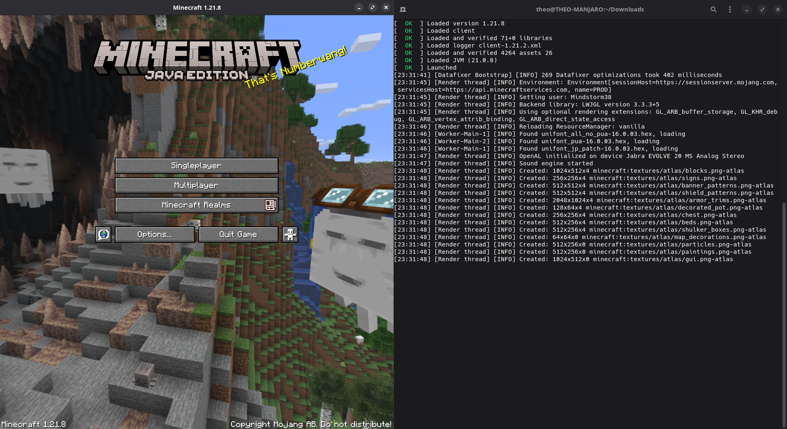

# Portable Minecraft Launcher
Cross platform command line utility for launching Minecraft quickly and reliably with 
included support for Mojang versions and popular mod loaders. It is also available as 
a Rust crate for developers ~~and bindings for C and Python~~ (yet to come).



## Table of contents
- [Installation](#installation)
  - [Binaries](#binaries)
  - [Cargo](#cargo)
  - [Linux third-party packages](#linux-third-party-packages)
- [Contribute](#contribute)
  - [Repositories](#repositories)
  - [Contributors](#contributors)
  - [Sponsors](#sponsors)
- [Rust documentation ⇗](https://docs.rs/portablemc/latest/portablemc)

## Installation

### Binaries

You can directly download and run the portable binaries that are pre-built and available
as assets on [release pages](https://github.com/mindstorm38/portablemc/releases).

These binaries have been compiled using open source tooling available in this repository. 
You can ensure that these binaries have been compiled by the official PortableMC project 
by checking the PGP signature of the archive you downloaded, the PGP fingerprint of the 
PortableMC project is: `f659b0f0b84a26cac635d72948caee8dc3456b2f`

You can download the full public certificate online:
- [Ubuntu Keyserver](https://keyserver.ubuntu.com/pks/lookup?search=F659+B0F0+B84A+26CA+C635+D729+48CA+EE8D+C345+6B2F&fingerprint=on&op=index)
- [Maintainer server](https://www.theorozier.fr/assets/pgp/portablemc.asc)

### Cargo


If you have a Rust toolchain with Cargo, you can build and install PortableMC and its 
CLI straight from [crates.io](https://crates.io/crates/portablemc-cli), this is where 
the latest development versions are pushed first, before being built for specific 
targets.

```sh
cargo install portablemc-cli
```

If you are a developer willing to use PortableMC as a library to develop your own 
launcher, it is also available on [crates.io](https://crates.io/crates/portablemc).

```sh
cargo add portablemc
```

### Linux third-party packages
[](https://repology.org/project/portablemc/versions)

### Arch Linux
- Prebuilded binary version [`portablemc-bin`](https://aur.archlinux.org/packages/portablemc-bin) available on AUR

## Contribute

### Repositories

The source code is currently tracked using Git and hosted [on GitHub](https://github.com/mindstorm38/portablemc). 
We also have an official team workspace [on Codeberg.org](https://codeberg.org/portablemc).

### Contributors
This launcher would not be as functional without the contributors, and in particular the 
following for their bug reports, suggestions and pull requests to make the launcher 
better: 
[GoodDay360](https://github.com/GoodDay360), 
[Ristovski](https://github.com/Ristovski),
[JamiKettunen](https://github.com/JamiKettunen),
[Maxim Balashov](https://github.com/rsg245),
[MisileLaboratory](https://github.com/MisileLab) and
[GooseDeveloper](https://github.com/GooseDeveloper).

There must be a lot of hidden issues, if you want to contribute you just have to install 
and test the launcher, and report every issue you encounter, do not hesitate!

### Sponsors
I'm currently working on my open-source projects on my free time. So sponsorship is an
extra income that allows me to spend more time on the project! This can also help me
on other open-source projects. You can sponsor this project by donating either on
[GitHub Sponsors](https://github.com/sponsors/mindstorm38) or 
[Ko-fi](https://ko-fi.com/theorozier). I've always been passionate about open-source
programming and the relative success of PortableMC have been a first surprise to me, 
but the fact that people are now considering to support me financially is even more
rewarding! **Huge thanks to [Erwan Or](https://github.com/erwanor) and 
[user10072023github](https://github.com/user10072023github) for their donations!**
