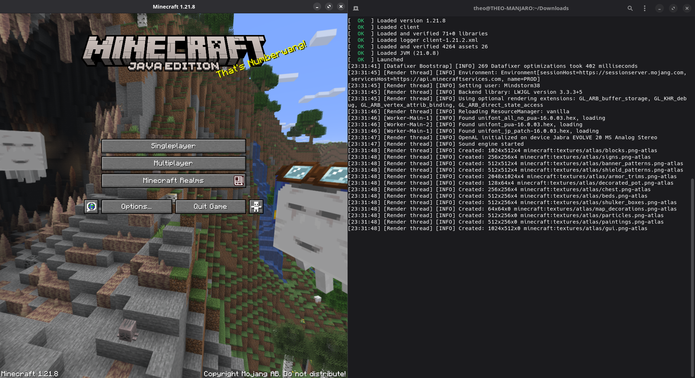

# PortableMC
Cross platform command line utility for launching Minecraft quickly and reliably with 
included support for Mojang versions and popular mod loaders. It is also available as 
a Rust crate for developers ~~and bindings for C and Python~~ (yet to come).



## Table of contents
- [Features](#features)
- [Installation](#installation)
  - [Binaries](#binaries)
  - [Cargo](#cargo)
  - [Linux packages](#linux-packages)
    - [Arch Linux](#arch-linux)
    - [NixOS](#nixos)
- [Usage](#usage)
- [Contribute](#contribute)
  - [Repositories](#repositories)
  - [Contributors](#contributors)
  - [Sponsors](#sponsors)
- [Rust documentation ⇗](https://docs.rs/portablemc/latest/portablemc)

## Features

- **Install and launch a version in 1 command.**
- Supports Mojang versions, and many mod loaders which are installed seamlessly: **Forge**, **NeoForge**, **Fabric**, Quilt, LegacyFabric and Babric.
- Automatically fixing known issues of the game, can be disabled if desired;
- Options for supporting unsupported systems and architectures, such as RaspberryPi/Arm;
- And more flags and options to configure the launch...
- Able to launch **offline** or with a **Microsoft account**.
- Browse the supported versions, for any kind of versions.
- Very descriptive output and errors, with configurable verbosity.
- Various output mode, including machine-readable output mode.
- Fast parallel downloading of game files.
- Find your system Java runtime, if compatible, and fallback to Mojang provided ones when available.
- Distributed for many mainstream OS and architectures.

## Installation

### Binaries


You can directly download and run the portable binaries that are pre-built and available
as assets on [release pages](https://github.com/mindstorm38/portablemc/releases).

These binaries have been compiled using open source tooling available in this repository. 
You can ensure that these binaries have been compiled by the official PortableMC project 
by checking the PGP signature of the archive you downloaded, the PGP fingerprint of the 
PortableMC project is: `f659b0f0b84a26cac635d72948caee8dc3456b2f`

You can download the full PGP certificate online:
- [Ubuntu Keyserver](https://keyserver.ubuntu.com/pks/lookup?search=F659+B0F0+B84A+26CA+C635+D729+48CA+EE8D+C345+6B2F&fingerprint=on&op=index)
- [Maintainer server](https://theorozier.fr/assets/pgp/portablemc.asc.html)

### Cargo


If you have a Rust toolchain with Cargo, you can build and install PortableMC and its 
CLI straight from [crates.io](https://crates.io/crates/portablemc-cli), this is where 
the latest development versions are pushed first, before being built for specific 
targets.

```sh
cargo install portablemc-cli
```

If you are a developer willing to use PortableMC as a library to develop your own 
launcher, it is also available on [crates.io](https://crates.io/crates/portablemc).

```sh
cargo add portablemc
```

### Linux packages

We try to deploy the package to different Linux packaging repositories, some are managed
by maintainers of the project (first-party) and some by external maintainers (third-party).

#### Arch Linux


Arch Linux packages are maintained by PortableMC team.

- Build from source: [`portablemc`](https://aur.archlinux.org/packages/portablemc), available on AUR
- Prebuilt binaries: [`portablemc-bin`](https://aur.archlinux.org/packages/portablemc-bin), available on AUR

Prebuilt binaries requires you to install the PGP certificate, as described [above](#binaries).

#### NixOS

Nix package is maintained by @TomaSajt, at [`nixpkgs/portablemc`](https://github.com/NixOS/nixpkgs/blob/master/pkgs/by-name/po/portablemc/package.nix).

## Usage

This section shows example usage to get started with PortableMC.

```shell
# Start the latest Mojang release, with a random username and default options...
portablemc start

# Start a specific version, let's say 1.16.5...
portablemc start 1.16.5
# You can list the Mojang versions...
portablemc search
# Search on the release versions, and limit to 10 entries...
portablemc search --channel release -l10

# Choose your username in offline mode...
portablemc start -u MyUsername

# Authenticate into your Minecraft account...
portablemc auth login
# List your authenticated accounts...
portablemc auth list
# Start the game with your authenticated account...
portablemc start -u <your username> -a
```

## Contribute

### Repositories

The source code is currently tracked using Git and hosted [on GitHub](https://github.com/mindstorm38/portablemc). 

We also have an official team workspace [on Codeberg.org](https://codeberg.org/portablemc) where we host a mirror 
of this repository and the official third-party packaging sources.

### Releasing

Releasing process is mostly managed by GitHub actions, it reacts to new tags being 
pushed to the repository by a repository admin. This tag should be named `v<version>` where
`<version>` is the same as the one in `Cargo.toml`, if not matching, the actions will fail.

Once completed, a draft release note is attached to that new tag under [releases](https://github.com/theorzr/portablemc/releases),
you should complete it with the actual changelog, and then publish the release note.
Note that the release artifacts are automatically uploaded and signed by the actions.

Then, you should manage the releasing of official third-party packaging, such as 
[portablemc-arch](https://codeberg.org/portablemc/portablemc-arch) and
[portablemc-bin-arch](https://codeberg.org/portablemc/portablemc-bin-arch).

### Contributors
This launcher would not be as functional without the contributors, and in particular the 
following for their bug reports, suggestions and pull requests to make the launcher 
better: 
[GoodDay360](https://github.com/GoodDay360), 
[Ristovski](https://github.com/Ristovski),
[JamiKettunen](https://github.com/JamiKettunen),
[Maxim Balashov](https://github.com/rsg245),
[MisileLaboratory](https://github.com/MisileLab) and
[GooseDeveloper](https://github.com/GooseDeveloper).

There must be a lot of hidden issues, if you want to contribute you just have to install 
and test the launcher, and report every issue you encounter, do not hesitate!

### Sponsors
I'm currently working on my open-source projects on my free time. So sponsorship is an
extra income that allows me to spend more time on the project! This can also help me
on other open-source projects. You can sponsor this project by donating either on
[GitHub Sponsors](https://github.com/sponsors/mindstorm38) or 
[Ko-fi](https://ko-fi.com/theorozier). I've always been passionate about open-source
programming and the relative success of PortableMC have been a first surprise to me, 
but the fact that people are now considering to support me financially is even more
rewarding! **Huge thanks to [Erwan Or](https://github.com/erwanor) and 
[user10072023github](https://github.com/user10072023github) for their donations!**
